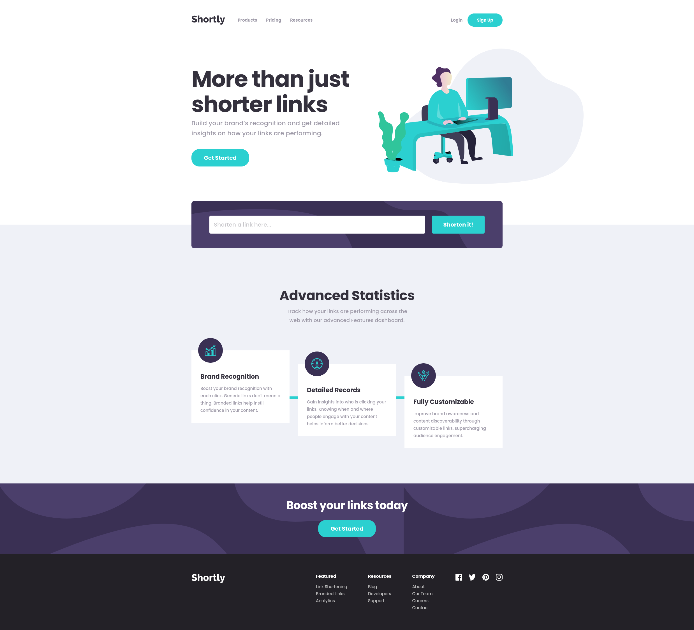

# Frontend Mentor - Shortly URL shortening API Challenge solution

This is a solution to the [Shortly URL shortening API Challenge challenge on Frontend Mentor](https://www.frontendmentor.io/challenges/url-shortening-api-landing-page-2ce3ob-G). Frontend Mentor challenges help you improve your coding skills by building realistic projects.

## Table of contents

- [Overview](#overview)
  - [The challenge](#the-challenge)
  - [Screenshot](#screenshot)
  - [Links](#links)
- [My process](#my-process)
  - [Built with](#built-with)
  - [What I learned](#what-i-learned)
  - [Continued development](#continued-development)
  - [Useful resources](#useful-resources)
- [Author](#author)
- [Acknowledgments](#acknowledgments)

**Note: Delete this note and update the table of contents based on what sections you keep.**

## Overview

### The challenge

Users should be able to:

- View the optimal layout for the site depending on their device's screen size :heavy_check_mark:
- Shorten any valid URL :heavy_check_mark:
- See a list of their shortened links, even after refreshing the browser :heavy_check_mark:
- Copy the shortened link to their clipboard in a single click :heavy_check_mark:
- Receive an error message when the `form` is submitted if:
  - The `input` field is empty :heavy_check_mark:

### Screenshot

### Links

- Solution URL: [https://shortlyurls.netlify.app/](https://www.frontendmentor.io/solutions/mobilefirst-responsive-landing-page-built-with-react-77_ioOnBi)
- Live Site URL: [https://shortlyurls.netlify.app/](https://shortlyurls.netlify.app/)

## My process

### Built with

- Semantic HTML5 markup
- Component-Scoped Styles with CSS Modules
- Flexbox
- CSS Grid
- Mobile-first workflow
- [React](https://reactjs.org/) - JS library
- Axios - Promise-based library for asynchronous HTTP requests
- [t.ly API](https://t.ly/home)

### What I learned

This project helped me realize the importance of pseudoelements in quirky landing page designs.

The section "Advanced Statistics" took a while to figure out how I was going to implement it, but I am very happy with the way it came out - including its responsiveness.

As with every one of these projects, I aimed to implement the figma design as accurately as possible, pixel for pixel. In the end, my design is nearly 100% accurate to the design given to me. My flexbox and grid skills have continued to improve with each project I take on, and I am discovering that it is easier to not overcomplicate the implementation of designs in my HTML/CSS now.

### Continued development

The paid-for t.ly API includes more advanced statistics with each shortened link - such as how many people used the link, the location in which the click originated, ect. If I were to have access to the premium service, I would have included more details for each shortened link.

## Author

- Frontend Mentor - [@tkressma](https://www.frontendmentor.io/profile/tkressma)
- Twitter - [@tom_kressman](https://www.twitter.com/tom_kressman)
